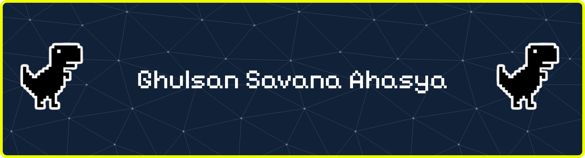

---

# Hi, I'm Ghulsan Savana Ahasya 👋
I'm a passionate **Front-End Web Developer** who loves turning ideas into clean, responsive, and modern websites. Currently focused on building a strong foundation in front-end development, with the goal of becoming a **Full-Stack Developer** in the future.

I believe that **progress** is built **one line of code at a time**.
Every project is a chance to **grow**, **experiment**, and **learn** something new through code.

---

## 🔧 Tech Stack

---

## 📘 Learning Goals

---

## 📫 Contact
  